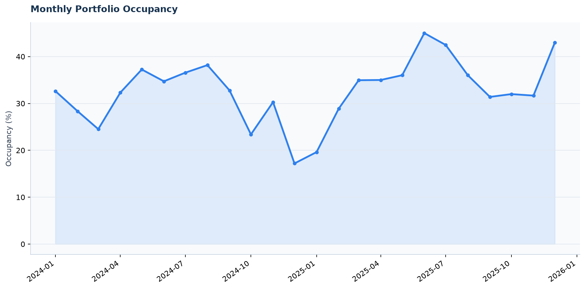
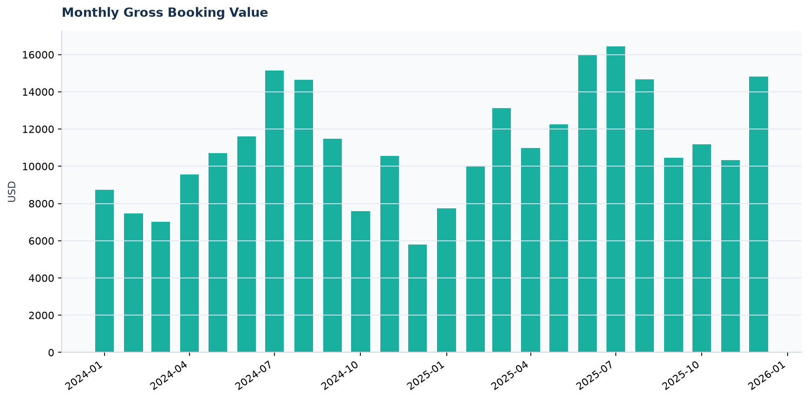
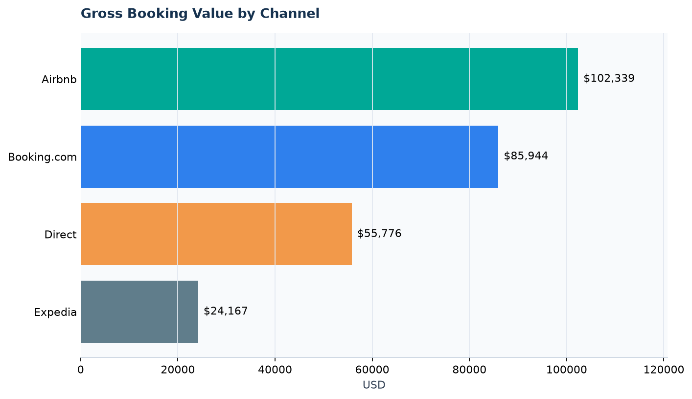
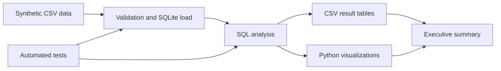

# Rental Data Analytics


[](https://github.com/TheKhadaJhin/rental-data-analytics/actions/workflows/tests.yml)


An end-to-end **SQL and Python analytics project** for a fictional short-term-rental portfolio. It turns raw booking records into business-ready KPIs, channel and property rankings, data-quality checks, visual reports, and an executive summary.

The project demonstrates advanced SQL, analytical thinking, reproducible Python workflows, and clear communication of business findings.

## Business questions

- How are occupancy, ADR, RevPAR, and revenue changing month by month?
- Which properties and cities generate the most value?
- Which booking channels drive revenue, and where are cancellations highest?
- How far in advance do guests book and how long do they stay?
- Can common data-quality problems be detected before reporting?

## Results at a glance

The deterministic sample contains **12 properties and 607 bookings** from January 2024 through December 2025.

| KPI | Result |
|---|---:|
| Gross booking value | $268,226 |
| Completed bookings | 545 |
| Booked nights | 2,766 |
| Weighted occupancy | 32.8% |
| Cancellation rate | 10.2% |
| Data-quality issues | 0 |

Selected findings:

- **Bariloche Lake View** was the top property by gross booking value at **$37,360**.
- **Airbnb** generated **38.1%** of portfolio revenue, the highest share among channels.
- **July 2025** was the strongest month at **$16,432** in gross booking value.
- Second-year revenue increased **23.1%** as the portfolio matured.
- **Direct** had the highest cancellation rate at **13.1%**, suggesting a useful area for investigation.

The complete interpretation and recommended actions are in the [executive summary](reports/executive_summary.md).

## Visual output

### Monthly occupancy



### Monthly gross booking value



### Channel performance



## Analytical workflow



### SQL techniques

- Multi-table joins and conditional aggregation
- Recursive CTEs to allocate revenue to individual stay nights
- Window functions for rankings, revenue share, and year-over-year comparisons
- Date-spine generation to preserve months with no activity
- Data-quality checks for duplicates, orphan records, invalid dates, ratings, prices, and overlapping stays

### Python techniques

- Deterministic synthetic-data generation
- SQLite database creation and constraint enforcement
- Reusable analysis pipeline with `pandas`
- Automated reporting and chart generation with `matplotlib`
- Integration testing with Python's standard `unittest` framework

## Repository structure

```text
rental-data-analytics/
├── data/
│   ├── raw/                 # Versioned synthetic source data
│   └── processed/           # Generated SQLite database (ignored by Git)
├── docs/
│   └── data_dictionary.md
├── reports/
│   ├── data/                # SQL query results
│   ├── figures/             # Generated charts
│   └── executive_summary.md
├── sql/
│   ├── 01_schema.sql
│   ├── 02_data_quality_checks.sql
│   ├── 03_monthly_kpis.sql
│   ├── 04_property_performance.sql
│   ├── 05_channel_performance.sql
│   └── 06_city_trends.sql
├── src/
│   ├── config.py
│   ├── generate_sample_data.py
│   ├── load_data.py
│   └── run_analysis.py
├── tests/
│   └── test_pipeline.py
├── requirements.txt
└── run_pipeline.py
```

## Run locally

Requirements: Python 3.10 or newer.

```bash
git clone https://github.com/TheKhadaJhin/rental-data-analytics.git
cd rental-data-analytics

python -m venv .venv
```

Activate the environment:

```bash
# Windows PowerShell
.venv\Scripts\Activate.ps1

# macOS or Linux
source .venv/bin/activate
```

Install dependencies and run the complete workflow:

```bash
pip install -r requirements.txt
python run_pipeline.py
```

Run the automated checks:

```bash
python -m unittest discover -s tests -v
```

The same integration checks run on every push and pull request through [GitHub Actions](https://github.com/TheKhadaJhin/rental-data-analytics/actions/workflows/tests.yml). The test suite regenerates the synthetic dataset, SQLite database, and analytical reports before checking row counts, unique booking IDs, data quality, monthly metrics, and property rankings. Open the Tests badge above to inspect the latest run and its logs.

The pipeline can be rerun safely: the same synthetic dataset and reports are regenerated every time.

## Metric definitions

- **Occupancy:** booked nights divided by available property nights.
- **ADR:** lodging revenue divided by booked nights.
- **RevPAR:** lodging revenue divided by available property nights.
- **Gross booking value:** lodging revenue plus cleaning fees for completed stays.
- **Cancellation rate:** cancelled bookings divided by all bookings.

Checkout dates are excluded from occupied-night counts. Lodging revenue is allocated to the actual night stayed; cleaning fees are assigned to the check-in month.

## Worked SQL example: a stay across two months

The committed [synthetic source data](data/raw/bookings.csv) includes booking
`B0002`: check-in on **2024-01-28**, checkout on **2024-02-03**, a nightly rate of
**$66.16** and a one-time cleaning fee of **$25.50**.

The `booking_nights` recursive CTE in [the monthly KPI query](sql/03_monthly_kpis.sql)
expands the stay into six occupied nights: January 28–31 and February 1–2.
Checkout on February 3 is excluded. The `cleaning_metrics` CTE assigns the fee once,
to January, because that is the check-in month.

The [read-only verification query](sql/examples/booking_B0002.sql) isolates this booking
and returns:

| Month | Booked nights | Lodging revenue (USD) | Cleaning revenue (USD) | Gross booking value (USD) |
|---|---:|---:|---:|---:|
| 2024-01 | 4 | 264.64 | 25.50 | 290.14 |
| 2024-02 | 2 | 132.32 | 0.00 | 132.32 |

The total is **6 nights and $422.46**, but the revenue belongs to two months.
Assigning the whole stay to January would overstate January's occupancy and revenue
and understate February's. Counting the cleaning fee on every night would also
overstate gross booking value.

From the repository root, after installing the dependencies, load the committed
synthetic CSVs and execute the example with Python's built-in SQLite driver:

```bash
python src/load_data.py
python -c "import sqlite3; from pathlib import Path; db=sqlite3.connect('file:data/processed/rental_analytics.db?mode=ro', uri=True); print(*db.execute(Path('sql/examples/booking_B0002.sql').read_text(encoding='utf-8')), sep='\n'); db.close()"
```

Output columns follow the table above. This example was checked against the original
monthly KPI query using only `B0002`; the portfolio query and its reporting rules are
unchanged.

## Data privacy and limitations

All records are **synthetic and generated locally**. The repository contains no real guest names, addresses, contact details, credentials, or payment information. The sample is designed for portfolio demonstration and should not be interpreted as real market performance.

## Author

**Mario Fuentes** — Computer Engineering · Backend Development · Data & Automation

[GitHub](https://github.com/TheKhadaJhin)
